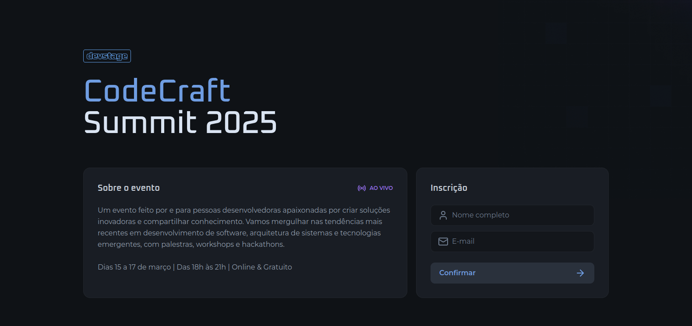
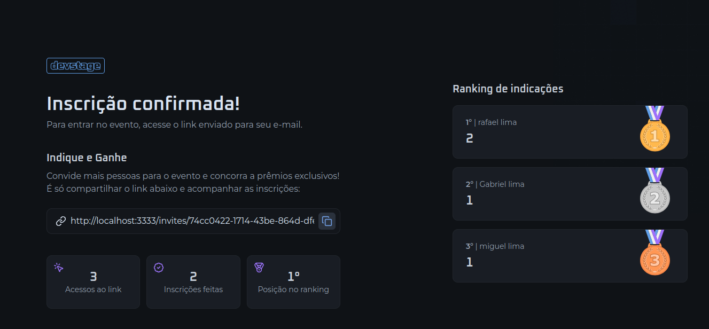

# 🚀 NLW Rocketseat

Este é um projeto desenvolvido durante o **[NLW da Rocketseat](https://app.rocketseat.com.br/)**, utilizando **Next.js e uma API na stack de node.js (somente a parte do next que foi desenvolvida)**. O objetivo do projeto é criar um ranking de pessoas que mais compartilharam o seu proprio link de cadastro.

## 📸 Captura de Tela

##### Tela inicial de cadastro para gerar um link personalizado


##### Tela onde é mostrado o ranking de indicações

---

## 🛠 Tecnologias Utilizadas

O projeto foi desenvolvido com as seguintes tecnologias:

- **Frontend:** [Next.js](https://nextjs.org/)
- **Doc components front** [Storybook](https://storybook.js.org/)
- **Backend:** [Node.js](https://nodejs.org/) (Rodando em Docker)
- **Banco de Dados:** [PostgreSQL](https://www.postgresql.org/) (Rodando em Docker)
- **Cache:** [Redis](https://redis.io/) (Rodando em Docker)
- **Gerenciamento de Pacotes:** npm
- **Containerização:** Docker & Docker Compose

---

## 🚀 Como Rodar o Projeto Localmente

### 🖥️ **1. Clone o Repositório**
```bash
git clone https://github.com/RafaelLimaReis/nwl_rocketseat.git
cd nwl_rocketseat
```

### ⚙️ **2. Configurar o Backend (Docker)**

- Suba os containers do backend, PostgreSQL e Redis com Docker Compose:
```bash
cd backend
docker-compose up -d
```

- Rode o comando npm para gerar as tabelas:
```bash
npm run db:migrate
```

- Start a api
```bash
npm run dev
```
O .env já esta configurado para rodar localmente e
o backend estará rodando em `http://localhost:3333`

---

### 🎨 **3. Configurar o Frontend**
```bash
cd ../frontend
npm install  # ou yarn install
```

- Inicie o frontend:
```bash
npm run dev  # ou yarn dev
```

O frontend estará rodando em `http://localhost:3000`

- Caso queira olhar a doc dos components (reutilizaveis) que existem no projeto:
```bash
npm run storybook
```
---

## 📞 Contato
Caso tenha dúvidas, entre em contato:

- [LinkedIn](https://www.linkedin.com/in/rafael-lima-reis/)
- Email: rafaellimareis01@gmail.com

---

### ⭐ Se gostou, deixe uma estrela no repositório!
Ajude a divulgar esse projeto dando um **star** ⭐ no GitHub! 😃

